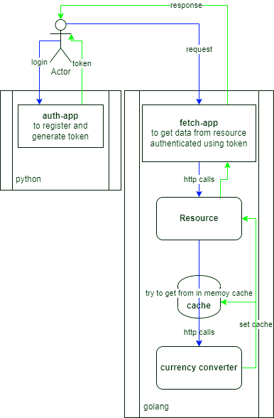

# White-whale API for eFishery

## _A fetch app REST API in microservices architecture_
###
The two microservices are: 
    
    1. auth-app -> login/register endpoints and get token, this app is written in Python using Flask Framework
    2. fetch-app -> get data from source endpoint, this app is written in Golang using Beego Framework


## Service Flow




## Tech Stack

**Language:** Go, Python

**Framework:** [Beego](https://github.com/beego/beego), [Flask](https://flask.palletsprojects.com/en/2.2.x/)


## Run Locally

Clone the project to your Go environment ($GOPATH/src)

```bash
  git clone https://github.com/kidboy-man/white-whale-api.git
```

Go to the project directory

```bash
  cd white-whale-api
```

Using Docker, to run this app do: 

```bash
  docker-compose up -d
```
This will run the white-whale-api with 2 containers, those are: auth-app and fetch-app.

Using the app:

    1. Open your browser, go to http://localhost:5000/swagger -> Auth-App Swagger Api,
       can do register on regiser endpoint. Choose your phone and role.
    2. Do login on login endpoint using your registered phone. Copy the token response value.
    3. Get your details and jwt claims using account endpoint on /me. Paste your token in format `Bearer <token>`.
    4. Open new tab, go to http://localhost:8080/swagger -> Fetch-App Swagger Api.
       You can get storages and its aggregated value using corresponding endpoints.
       Paste the token in Authorization column in format `Bearer <token>`.

## API Reference
#### Auth-App Swagger: 
http://localhost:5000/swagger
#### Fetch-App Swagger: 
http://localhost:8080/swagger


## Troubleshooting

If the service container is exited/failed, this happens due to it depends on the database. For now, just re-run the corresponding service container. Or you can do docker-compose per service

```bash
    docker-compose up -d auth-app
    docker-compose up -d fetch-app
```

